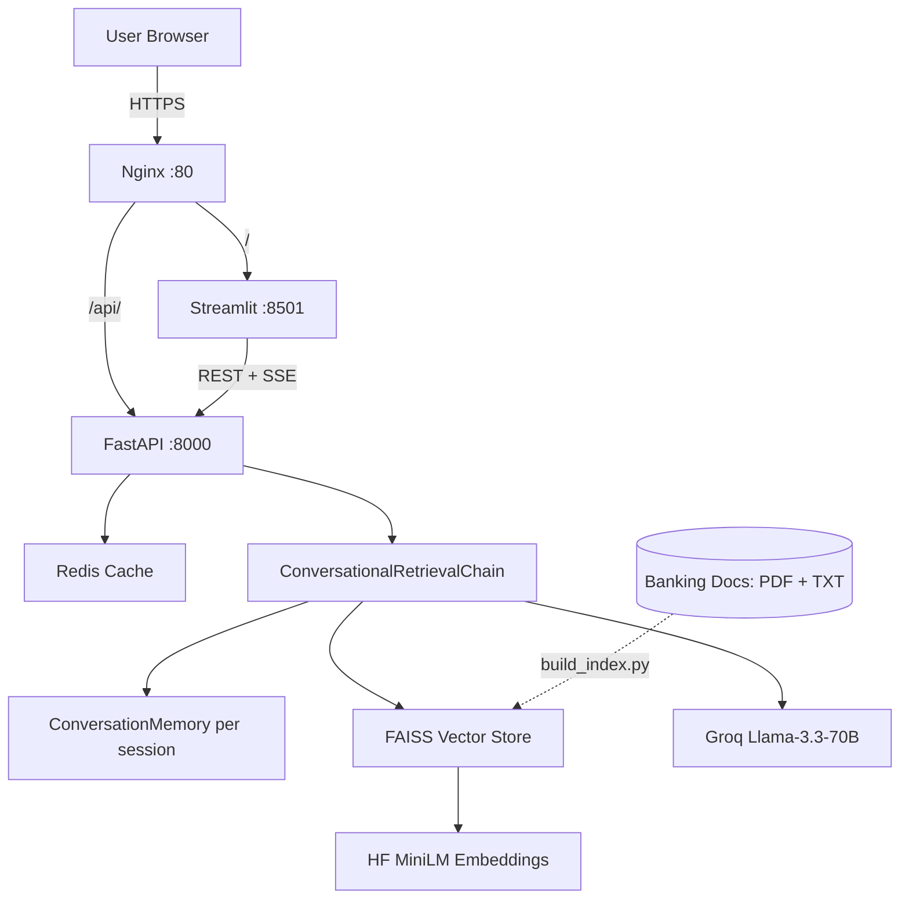

# Architecture

## Request Flow

1. User types a question in the Streamlit chat UI.
2. Streamlit POSTs to FastAPI `/chat/stream` (proxied through Nginx at `/api/chat/stream`).
3. FastAPI checks Redis for a cached `(session_id + query)` hit.
4. On miss, a similarity check on FAISS decides if retrieval is strong enough. Weak matches return a fallback message without calling the LLM.
5. For useful retrieval, ConversationalRetrievalChain rewrites the question using per-session ConversationBufferWindowMemory (k=5), then retrieves 5 diverse chunks via MMR (`fetch_k=15, lambda=0.6`).
6. Retrieved chunks, chat history, and the banking prompt are sent to Groq's Llama-3.3-70B with streaming enabled.
7. Tokens stream back to the browser via Server-Sent Events. The final event carries source citations.
8. The complete answer and sources are written to Redis (TTL 1 hour).

## Index Build

`backend/build_index.py` walks `data/`, loads every TXT/PDF, cleans and chunks at 600 chars with 120 overlap, embeds with MiniLM-L6-v2 (384-dim, CPU), and persists to `chroma_db/`. Re-run any time `data/` changes.

## Process Topology on EC2

- `systemd` units `banking-backend.service` and `banking-frontend.service` keep the two Python processes alive with `Restart=always`.
- Nginx terminates port 80 and reverse-proxies to Streamlit (root) and FastAPI (`/api/`), with `proxy_buffering off` on `/api/` for SSE streaming.
- Redis runs as the system service `redis-server.service`.
- A 2GB swap file is provisioned on the t2.micro so the embedding model can load (1GB RAM alone is insufficient).
